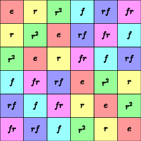
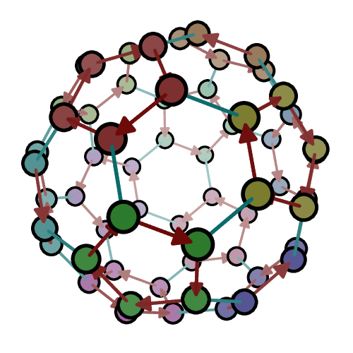

# Group Explorer Graphics from node or the command line

## Purpose

This project exposes most of the core functionality of [Group Explorer
3](https://github.com/nathancarter/group-explorer) as a node.js module, and
extends its rendering capabilities to vector graphics formats (SVG, PDF) as
well as PNG.

It also provides a command-line interface to the same, so that you can
generate vector graphics illustrations of group theory even if you do not
want to write code.

## Status

This is a beta release.  I think it's working pretty well, but you can try
to find bugs and report them with the "issues" link above.

## Examples

```
$ ge-draw S_3 mult outfile=s3.png
```



```
$ ge-draw A_5 cayley fogLevel=0.9 nodeScale=3 outfile=a5.png \
          diagram='Truncated icosahedron' showNames=false \
          highlight-node=left-35
```



## Documentation

For the command-line interface:
 * [Using the command-line interface](docs/cli.md)

For the node.js module:
 * [Basic API for this module](docs/basic-api.md)
 * [Drawing Cayley diagrams](docs/drawing-cayley-diagrams.md)
 * [Drawing multiplication tables](docs/drawing-multiplication-tables.md)
 * [Drawing cycle graphs](docs/drawing-cycle-graphs.md)
 * [Drawing symmetry objects](docs/drawing-symmetry-objects.md)

## License

[](https://www.gnu.org/licenses/lgpl-3.0.en.html)
