# Drawing Cayley Diagrams

This file will document how to use `ge-lib.js` to draw Cayley diagrams.
But it does not yet do so, because that feature is not yet implemented.

This file expects that you have read the
[Basic API](basic-api.md) document.

## Construction

To create a Cayley diagram, just pass a group object to the `CayleyDiagram`
constructor:

```js
const A_4 = GE.Library.loadByName( 'A_4' );
const cd = new GE.CayleyDiagram( A_4 );
```

This will generate a Cayley diagram using default generators, laid out in
a rectangular grid.  This may not be what you want.  Other options include
choosing your own diagram generation parameters
(which is [documented in detail below](#generating-a-diagram)) or using a
predefined layout, if the group provides one.

When groups come with predefined Cayley diagram layouts, they are designed
to be aesthetically pleasing.  To construct one of those, pass its name as the
second parameter to the constructor, like this:

```js
const cd = new GE.CayleyDiagram( A_4, 'Truncated tetrahedron' );
```

To figure out what names are valid for a particular group, run code like
this:

```js
console.log( A_4.cayleyDiagrams.map( obj => obj.name ) );
```

Or just use the first one (as long as there is at least one):

```js
const cd = new GE.CayleyDiagram( A_4, A_4.cayleyDiagrams[0].name );
```

## Making an SVG, PDF, or PNG

This has not yet been implemented.

To draw a Cayley diagram as an SVG, PDF, or PNG, create an instance of the
`CayleyDiagramRenderer` class, passing your `CayleyDiagram` to the
constructor.

```js
const toBeDrawn = new GE.CayleyDiagramRenderer( cd );
```

To dump the result to a file, use any one of the following calls.

```js
toBeDrawn.renderSVGFile( 'cayley-diagram.svg' );
toBeDrawn.renderPDFFile( 'cayley-diagram.pdf' );
toBeDrawn.renderPNGFile( 'cayley-diagram.png' );
```

All are asynchronous and take an optional callback as second argument. The
reason for this is that they begin by doing a bunch of asynchronous
renderings of element names from MathML to SVGs before using the results to
compute best sizes for the resulting renderings.

*Consequently it is important to NOT run more than one of those commands in
immediate succession.*  Since they are asynchronous, they will try to run
simultaneously on the same object (`toBeDrawn`) and thus will be
simultaneously manipulating its internal state, which can result in
incorrect results.

## Options

You can set the following options that will be respected when rendering the
resulting representation of the 3D scene.  Each is specified by calling
`set( 'optionName', value )` in the `CayleyDiagramRenderer` after
constructing it and before calling `renderSVGFile()`, `renderPDFFile()`, or
`renderPNGFile()`.

 * `cameraPos` - same as for Symmetry Objects;
   [see documentation there](drawing-symmetry-objects.md#options)
 * `cameraUp` - same as for Symmetry Objects;
   [see documentation there](drawing-symmetry-objects.md#options)

Whether you load a pre-defined Cayley diagram or have one generated for you,
it will come with a default set of arrows that correspond to its layout.
But you can add to or remove arrows from that set at your convenience, like
so, after you're done with other settings, and before rendering:

```js
CD.removeLines(); // remove all arrows
CD.addLines( 5 ); // add the arrow for element 5
CD.addLines( 6 ); // add the arrow for element 6
CD.setLineColors(); // give all arrows distinct colors
```

By default, arrows in a Cayley diagram signify right multiplication by an
element.  You can alter this with one line of code, at any point before
rendering:

```js
CD.right_multiplication = false;
```

## A complete example

We provide a minimal script that can create an SVG, PDF, or PNG file for a
Cayley diagram of a group, together with the resulting images.

 * [Script: `examples/cayley-diagram.js`](../examples/cayley-diagram.js)
 * [Result: `examples/cayley-diagram.svg`](../examples/cayley-diagram.svg)
 * [Result: `examples/cayley-diagram.pdf`](../examples/cayley-diagram.pdf)
 * [Result: `examples/cayley-diagram.png`](../examples/cayley-diagram.png)

## Properties of Cayley diagrams

You can access the following properties of the `CayleyDiagram` instance
(not the `CayleyDiagramRenderer` instance).

 * The name of the diagram, if it was one that was built into the group
   definition in Group Explorer, as opposed to auto-generated
    * `cd.diagram_name`
 * The placement of arrowheads along the lines/curves on which they sit
    * `cd.arrowheadPlacement` (defaults to 1)
    * Set this to any value in the range 0 to 1.
    * For example, 0.5 means the midpoint of the curve, and 1 means its end.
 * The following properties are the same for Cayley diagrams as for
   objects of symmetry; see
   [the documentation there](drawing-symmetry-objects.md#properties-of-symmetry-objects)
   for details.
    * `cd.nodes`
    * `cd.lines`
    * `cd.zoomLevel`
    * `cd.lineWidth`
    * `cd.nodeScale`
    * `cd.fogLevel`

## Generating a diagram

To ask Group Explorer to generate a diagram from predefined parameters,
follow these instructions.  We assume you have chosen a list of generators,
let us call them `g1` and `g2`, for a concrete example.  These will
be chosen from among the elements of the group, `group.elements`.

The generators will be used to create a grid of group elements in memory.
Since we are considering an example with only two generators, the grid would
look something like this, where n and m are the orders of `g1` and `g2`,
respectively.
```
   e     g1       g1^2       ...  g1^n
   g2    g1*g2    g1^2*g2    ...  g1^n*g2
   :     :        :               :
   g2^m  g1*g2^m  g1^2*g2^m  ...  g1^n*g2^m
```
For more generators, the grid is three-dimensional, four-dimensional, or
more, as needed.  The grid is not always perfectly rectangular, due to
the structure of the group.  (That is, there may be some empty entries,
or "shorter rows".)

*The options you choose will determine how such a grid is laid out in space
to form a diagram.*  In such a grid, notice that each generator determines
an axis, so we will specify the grid's layout one generator at a time.

For each generator, you will need to choose a layout, a direction, and a
nesting level, as we now explain.
 * Layout:  How should the axis corresponding to that generator be laid
   out in space?  There are three options.
    * Linear
       * in a straight line, with an arrow connecting the end of the
         line to the beginning
       * represented in code by `GE.CayleyDiagram.LINEAR_LAYOUT`
       * Example:<br>
         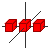
    * Circular
       * in a circle, with each element of the circle oriented the same way
       * represented in code by `GE.CayleyDiagram.CIRCULAR_LAYOUT`
       * Example:<br>
         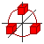
    * Rotated
       * in a circle, with each element of the circle rotated separately
       * represented in code by `GE.CayleyDiagram.ROTATED_LAYOUT`
       * Example:<br>
         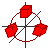
 * Direction:  Which of the axes in 3-space should be used for the layout
   you've chosen?  The options you have depend on the layout.
     * For linear layouts, choose any of the three axes.
        * `GE.CayleyDiagram.X_DIRECTION`<br>
          
        * `GE.CayleyDiagram.Y_DIRECTION`<br>
          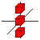
        * `GE.CayleyDiagram.Z_DIRECTION`<br>
          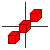
     * For circular layouts, choose any of the three planes.
        * `GE.CayleyDiagram.XY_DIRECTION`<br>
          
        * `GE.CayleyDiagram.XZ_DIRECTION`<br>
          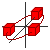
        * `GE.CayleyDiagram.YZ_DIRECTION`<br>
          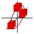
     * For rotated layouts, choose any of the three planes.
        * `GE.CayleyDiagram.XY_DIRECTION`<br>
          
        * `GE.CayleyDiagram.XZ_DIRECTION`<br>
          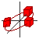
        * `GE.CayleyDiagram.YZ_DIRECTION`<br>
          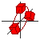
 * Nesting level:  How should we nest one layout inside another?

   To best illustrate what this question means, consider a group
   generated by two generators, and assume you've chosen a linear
   layout for generator 1 and a circular layout for generator 2.
   The question then becomes:  Do you want an *overall linear layout*
   with circles inside it, thus forming a line of circles?  Or do you
   want an *overall circular layout* with lines inside it, thus
   forming a circle of lines?  This is the question of "nesting level."

   Your nesting levels must form a permutation of the numbers
   `[0,1,...,n-1]` where n is the number of generators.  The
   default permutation (from 0 through n-1 in that order) nests the
   first generator as the innermost and the last as the outermost.
   Let us consider two examples.
    * Example 1:
       * Generator 1: linear layout, x axis, nesting=0
       * Generator 2: rotated layout, xy axes, nesting=1
       * This creates an overall rotated layout using generator 2
         (nesting=1 means outside) with lines inside it using generator 1
         (nesting=0 means inside).
       * Example using the group $D_4$:<br>
         (Note the rotated red line segments inside a circular layout.)<br>
         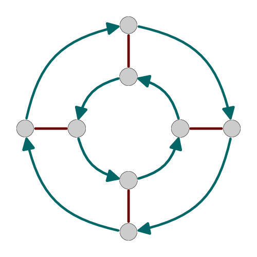
    * Example 2:
       * Generator 1: linear layout, x axis, nesting=1
       * Generator 2: rotated layout, xy axes, nesting=0
       * This creates an overall linear layout using generator 1
         (nesting=1 means outside) with circles inside it using generator 2
         (nesting=0 means inside).
       * Example using the group $D_4$:<br>
         (Note the sort-of-circular teal portions arrranged inside a simple,
         two-step, horizontal linear layout.)<br>
         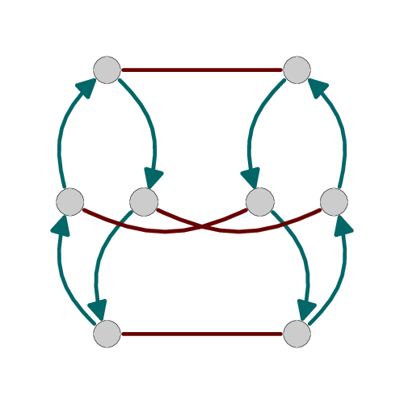

Assuming for our generators `g1` and `g2` we have layout values chosen
`L1` and `L2`, and axes values chosen `A1` and `A2`, and nesting levels
chosen `N1` and `N2`, then we tell the diagram how to generate itself with
a function call like the following.
```js
cd.setStrategies( [
    [ g1, L1, A1, N1 ],
    [ g2, L2, A2, N2 ]
    // if you had more generators, add their data here
] );
```

Here are two concrete examples, which were used to generate the two
illustrations shown above.
```js
// assuming you have done this:
const group = GE.Library.loadByName( 'D_4' );
const CD = new GE.CayleyDiagram( group );
// then you can either do this:
CD.setStrategies( [
    [ 5, GE.CayleyDiagram.LINEAR_LAYOUT,  GE.CayleyDiagram.X_DIRECTION,  0 ],
    [ 1, GE.CayleyDiagram.ROTATED_LAYOUT, GE.CayleyDiagram.XY_DIRECTION, 1 ]
] );
// or this (note only the final column is different):
CD.setStrategies( [
    [ 5, GE.CayleyDiagram.LINEAR_LAYOUT,  GE.CayleyDiagram.X_DIRECTION,  1 ],
    [ 1, GE.CayleyDiagram.ROTATED_LAYOUT, GE.CayleyDiagram.XY_DIRECTION, 0 ]
] );
// and render thereafter, as in other examples
```

## Old example

The following example was provided before there was a way to actually draw
Cayley diagrams with `CayleyDiagramRenderer`.  It is kept here merely for
reference.

```js
const dumpCayleyDiagram = ( cd, precision = 3 ) => {
    const f = n => Number( n ).toFixed( precision );
    console.log( `Cayley diagram for "${cd.group.shortName}":` );
    cd.nodes.map( node => {
        const color = new THREE.Color( node.color );
        console.log( `\t${node.element} @ `
                   + `(${f(node.point.x)},${f(node.point.y)},${f(node.point.z)}), `
                   + `rgb: (${f(color.r)},${f(color.g)},${f(color.b)}), ${node.label}` );
        // node.radius is typically undefined, so not dumping that out here
        if ( node.colorHighlight )
            console.log( `\t\tColor highlight: ${node.colorHighlight}` );
        if ( node.ringHighlight )
            console.log( `\t\tRing highlight: ${node.ringHighlight}` );
        if ( node.squareHighlight )
            console.log( `\t\tSquare highlight: ${node.squareHighlight}` );
    } );
    cd.lines.map( line => {
        const arrow = line.arrowhead ? '->' : '--';
        const cgroup = line.vertices[0].curvedGroup.map( v => v.element ).sort().join( ',' );
        const style = line.style ? `curve in ${cgroup}`
                                 : 'line';
        console.log( `\t${line.arrow}-arrow: `
                   + `${line.vertices[0].element}${arrow}${line.vertices[1].element} `
                   + `${line.color} ${style}` );
        // not reporting line.offset here, but it's the user-edited curvature
    } );
};
```
